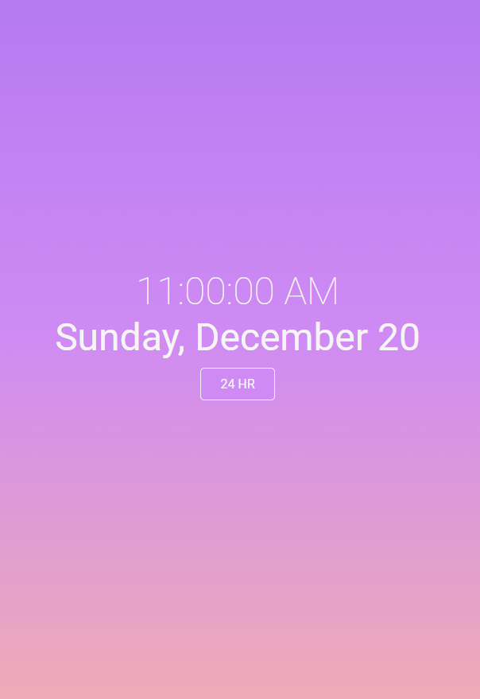

# Digital Clock App

*Digital Clock app that displays the current time and date with the option of 24 hour time display.*

View it [here](https://bcherrera14.github.io/digital-clock-app/)

## Summary

I used Javascript, HTML, and CSS to create a webpage that displays the current time and date. This clock includes an option to toggle between 12 and 24 hour time format. The clock includes a ticking function that displays the current seconds.

## Author

* **Bryan Herrera** - *Full-Stack Developer* - [Website](http://bryan-herrera.com) | [LinkedIn](https://www.linkedin.com/in/bryan-chris-herrera/)  